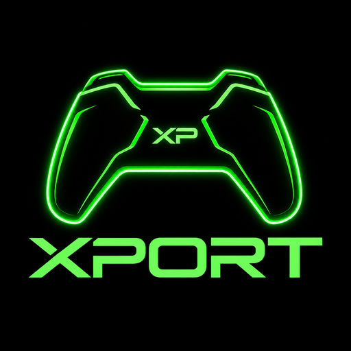

<p align="center"></p>

# XPort

[](LICENSES/AGPL-3.0-only-OpenSSL.txt)
[](https://github.com/Ibbolufc/XPort/actions/workflows/build-xbox.yml)

**XPort is a free, open-source PlayStation Remote Play client for Xbox Series X|S, running as a UWP app in Xbox Dev Mode.**
Stream your own PS4 or PS5 to the TV your Xbox is connected to and play it with an Xbox controller.

> **Status: early development.** Milestone 1, a minimal Xbox app shell, is in place. Remote Play itself is not yet
> wired into the Xbox app. See [ROADMAP.md](ROADMAP.md) for the phased plan and current progress.

## How it works

XPort reuses a proven, portable C implementation of the PlayStation Remote Play protocol (`lib/`), inherited from
[Chiaki](https://git.sr.ht/~thestr4ng3r/chiaki) / [chiaki-ng](https://github.com/streetpea/chiaki-ng). It covers
console discovery, wake-up, registration, the session handshake, the Takion stream with FEC, crypto, audio/video
packet handling and Internet (holepunch) play. The Xbox app (`xbox/`) is a thin native UWP frontend on top of it:

| Concern | Xbox implementation |
|---|---|
| App model | C++/WinRT `CoreApplication` (no XAML), packaged as a signed `.msix` |
| Rendering | Direct3D 11 swap chain on the `CoreWindow`, Direct2D/DirectWrite UI |
| Controllers | `Windows.Gaming.Input.Gamepad` mapped to the DualShock/DualSense layout |
| Video (planned) | H.264/HEVC hardware decode (D3D11VA) sharing the app's D3D11 device |
| Audio (planned) | Opus (lib) to XAudio2 |
| Rumble (planned) | Classic rumble + DualSense haptics converted to Xbox motors and impulse triggers |

Controller mapping: A/B/X/Y → Cross/Circle/Square/Triangle, LB/RB → L1/R1, LT/RT → L2/R2, stick clicks → L3/R3,
View → Share/Create, Menu → Options. The Xbox Guide button is reserved by the system, so the **PS button is
"hold Menu + View"**.

## Repository layout

| Path | What |
|---|---|
| `lib/` | Shared Remote Play library (C). All protocol, streaming and feature logic lives here. |
| `xbox/` | The Xbox Series X\|S UWP app ([xbox/README.md](xbox/README.md)). |
| `test/` | Unit tests for `lib/` (munit). |
| `cli/` | Small command-line tool (discover / wake) for exercising `lib/` on a PC. |
| `third-party/` | Vendored dependencies (nanopb, jerasure, gf-complete, curl). |

## Building

**Xbox app** (Windows, Visual Studio 2022 with the UWP workload):

```powershell
.\xbox\build.ps1            # builds and signs build-xbox\AppPackages\...\XPort_<version>_x64.msix
```

See [xbox/README.md](xbox/README.md) for requirements, deploying through the Xbox Device Portal, and logs.
Every push also builds the package in CI (artifact `XPort-xbox-x64`).

**Library + unit tests** (Linux/macOS, or Windows with clang-cl as in CI):

```sh
git submodule update --init test/munit third-party/nanopb third-party/jerasure third-party/gf-complete third-party/curl
cmake -S . -B build -G Ninja
cmake --build build
ctest --test-dir build
```

On Linux this needs `protoc`, Python 3 with `protobuf`, OpenSSL, json-c, miniupnpc and Opus development packages.
Pass `-DCHIAKI_LIB_FETCH_DEPS=ON` to build json-c/miniupnpc/opus from source instead. That is the default on
MSVC/clang-cl and for the Xbox build.

## Requirements to use

- An Xbox Series X|S in **Developer Mode** (see Microsoft's Xbox Dev Mode documentation). XPort is not distributed
  through the Microsoft Store.
- A PS4 or PS5 with Remote Play enabled, on the same network (LAN play) as the Xbox.

## Legal & responsible use

XPort is intended for use with games and content you own or are licensed to use, on hardware you own. It does not
circumvent copy protection or facilitate piracy.

This project is not affiliated with, endorsed or certified by Sony Interactive Entertainment or Microsoft.
"PlayStation", "PS4", "PS5" and "DualSense" are trademarks of Sony Interactive Entertainment Inc.; "Xbox" is a
trademark of Microsoft Corporation. All trademarks belong to their respective owners.

## License

GNU Affero General Public License v3.0 with an OpenSSL linking exception. See [COPYING](COPYING) and
[LICENSES/](LICENSES/). The complete corresponding source for any XPort build is this repository.

## Credits

XPort is built on [Chiaki](https://git.sr.ht/~thestr4ng3r/chiaki) by Florian Märkl and contributors, and
[chiaki-ng](https://github.com/streetpea/chiaki-ng) by Street Pea and contributors. Thanks to both teams for the
Remote Play implementation this project stands on.
